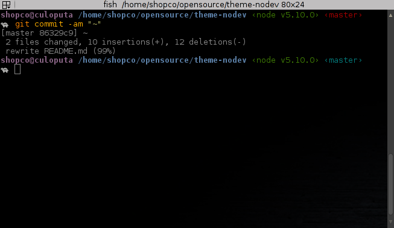

## About
This is the nodev fish shell theme. It's a turtle shell! 🐢

Forked from the [bira theme](https://github.com/oh-my-fish/theme-bira).

Display username, hostname, current path, node version/npm profile, git status and a turtle.

Display the latest error status in the right prompt.

Follow [these hints for emoji in your terminal](https://gist.github.com/robotslave/4633393).



## Requirements
You will need [`node`](https://nodejs.org) and [`npmrc`](https://www.npmjs.com/package/npm-profile-manager) in your `$PATH`.

## Installation
When running the fish shell, you can simply clone this repo and `source fish_prompt.fish`.

### Fisherman
```fish
fisher i orangecms/fish-theme-nodev
```
